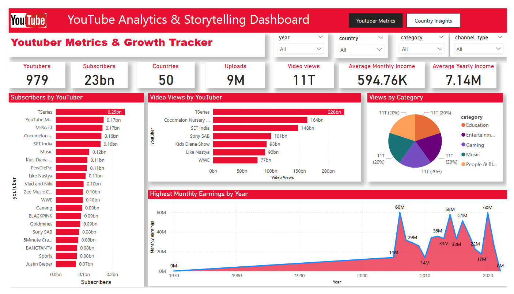
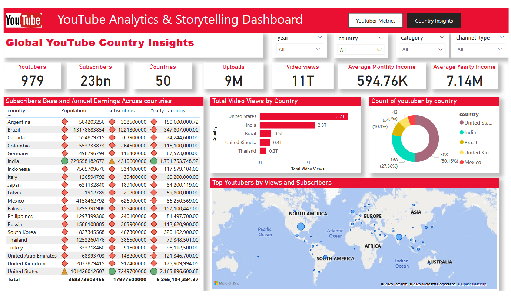

# YouTube Analytics & Storytelling Dashboard

This Power BI project analyzes a global dataset of YouTubers to uncover insights into creator performance, content categories, country-level trends, monetization, and growth. It blends YouTube channel data with demographic and economic indicators such as population and education enrollment across countries.

The dashboard is designed for analysts, content strategists, and data enthusiasts who want to explore the creator economy using real-world data.

---

## 📊 Dashboard Highlights

### 🎯 YouTuber Metrics
- Top creators by *Subscribers, **Views, and **Earnings*
- Growth trends over time
- Upload frequency by channel
- Category and channel-type analysis

### 🌍 Country-Level Insights
- Total subscribers and video views by country
- Population and education data vs. creator reach
- Interactive map of YouTuber locations (using lat/lon)
- Matrix of country: Population vs. Earnings vs. Subscribers

---

## 🔍 Key Features
- Cleaned YouTuber names using PostgreSQL REGEXP_REPLACE
- Null and special-character filtering
- *DAX measures* for dynamic KPIs and date-based trends
- *Calendar table* for time intelligence
- Slicers for *country, **category, **channel type, and **year*

---

## 📁 Project Files
- YouTube_Storytelling.pbix — Power BI Dashboard
- SQL_Queries.sql — PostgreSQL cleaning & transformation queries
- thumbnail.png — Banner image
- youtuber_metrics.png — YouTuber Metrics screenshot
- country_insight_dashboard.png — Country Insights screenshot
- README.md — This documentation

---

## 📥 How to Use This Dataset

### 🔹 For Power BI Users
1. Download and open the YouTube_Storytelling.pbix file in Power BI Desktop.
2. Explore pages like:
   - *YouTuber Metrics*
   - *Country Insights*
3. Use slicers to filter by *category, **country, **year, or **channel type*.
4. Review card visuals and map insights for storytelling or presentations.

### 🔹 For Analysts or Developers
- Use the SQL_Queries.sql file to replicate the data-cleaning logic in PostgreSQL.
- Reuse the DAX measures in your own dashboard.
- Connect your own YouTube dataset to this schema and apply the same visuals.

### 🔹 For Learners
This project is a great resource for learning:
- Data modeling in Power BI
- Creating map visuals and card KPIs
- Writing DAX for time-based calculations
- Cleaning dirty names with regex
- Building a full dashboard from raw to insight

---

## 🛠 Technologies Used
- *Power BI Desktop*
- *PostgreSQL*
- *SQL*
- *DAX*
- *Power Query (M)*

---

## 📈 What I Learned
- Real-world data is often messy — cleaning with SQL and regex is key.
- Data storytelling is more effective with contextual layers like country demographics.
- Combining Power BI's visuals with structured DAX makes dashboards both interactive and insightful.

---

## 🔗 Connect With Me

*LinkedIn:*  
[www.linkedin.com/in/ifeanyieric](https://www.linkedin.com/in/ifeanyieric)

Let's connect if you're working in analytics, BI, or digital storytelling!

---

## 📸 Dashboard Preview

---

## 📷 Full Dashboard Screenshots

### YouTuber Metrics Page

### Country Insight Page

